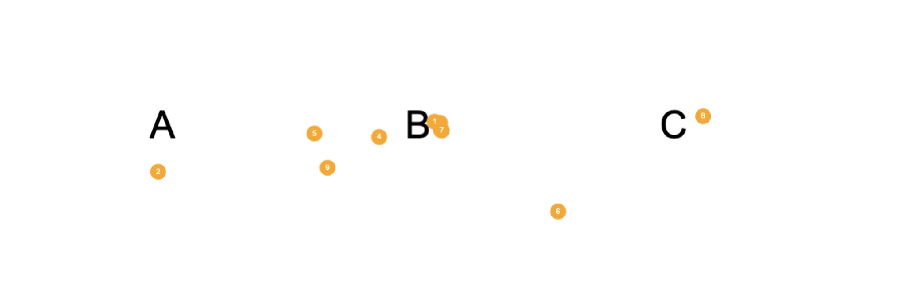

# people_walk_model
The orange balls are 'people'. They have some behaviour; the will cluster around  
one of the letters.  The file 'look.py' will attempt to determine which letter is  
most popular. 

# run it
node server  
localhost:3000/

# first pass
node server  
localhost:3000/test.html

# Agents: 
The orange balls will wonder around but each one has an opinion about the best  
letter and will be attracted to it. 

# look.py
Python to take a .png and find the most popular letter in the supplied image...      
Next up? Maybe do this as a series of screen shots to get the idea of 'time'...     

# Findings with this image: 
python3 look.py   
The most popular letter is: B   

# images
  
  
  
  

# Bluetooth RSSI measurments ( See 'BlueTooth.js'): 
node BlueTooth.js   
1   RSSI -84 from device GM_PEPS_VKS1  
2   RSSI -91 from device GM_PEPS_VKS3  
3   RSSI -92 from device GM_PEPS_VKM  
4   RSSI -97 from device EKG-db-18-fc  
5   RSSI -93 from device GM_PEPS_VKS4  
6   RSSI -95 from device Between 3ANC  
7   RSSI -96 from device N01NP  
8   RSSI -97 from device GM_PEPS_VKS2  
9   RSSI -90 from device NHXU9  
10   RSSI -94 from device N04ZN  
Stopped scanning after 10 measurments.  

# screen cap

